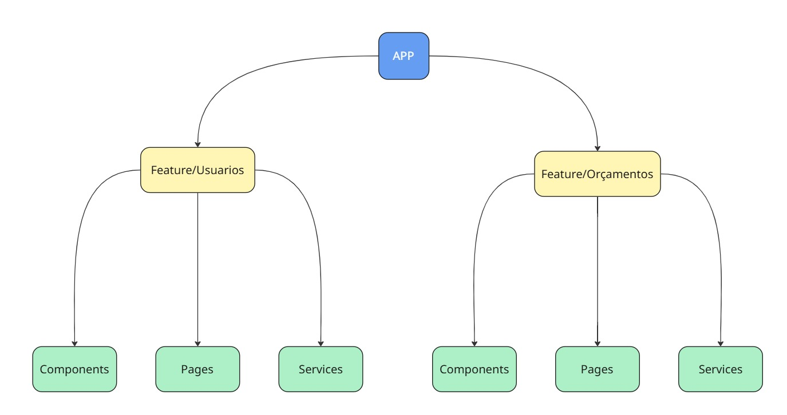

# Cotalizer — Frontend

SPA em **React + TypeScript (Vite)** para o Cotalizer: criação e gestão de orçamentos (com e sem IA), integração com a API, geração de PDFs (lado servidor) e autenticação (JWT / OAuth2 Google).

> Backend do projeto: API REST (Java/Spring) — repositório separado.
> 

---

## Visão Geral

O frontend do **Cotalizer** oferece a UI para:

- criação/edição de orçamentos (IA/tradicional),
- acompanhamento e listagens,
- autenticação do usuário (login por email/senha e Google),
- integração com a API para persistência e geração de PDFs (servidor).

Imagens:

- Diagrama de features: `docs/arquitetura.png`

---

## Arquitetura & Organização

**Estilo:** *Feature-based* (organização por domínio).
Principais domínios: **Orçamento** e **Usuário**.

> Dica visual rápida:
>



**Diretrizes:**

- Cada feature contém páginas, componentes próprios, hooks e serviços de API.

---

## Infra & Segurança

- **Hospedagem:** Render
- **Autenticação:** JWT (cookies HttpOnly) + OAuth2 Google.
- **CSRF/Cookies:** `SameSite=None`; em dev, verifique `Secure` e HTTPS (ver seção de execução local).

---

## Tecnologias Principais

- **React 18+, TypeScript, Vite**
- **Axios** para chamadas HTTP
- **react-router-dom** para roteamento
- **react-imask** para máscaras (ex.: CPF/CNPJ/telefone) — usado no `InputPadrao`

> A lista completa está no package.json.
> 

---

## Como Rodar Localmente

### Pré-requisitos

- Node 18+ (LTS 20 recomendado)
- pnpm **ou** npm **ou** yarn
- API rodando em `http://localhost:8080` (ou ajuste `VITE_API_BASE_URL`)

### Variáveis de ambiente (`.env.local`)

```bash
VITE_API_BASE_URL=http://localhost:8080
VITE_GOOGLE_CLIENT_ID=<sua-client-id.apps.googleusercontent.com>   # opcional
VITE_APP_ENV=local

```

### Instalação

```bash
pnpm install
# ou npm ci / yarn

```

### Dev server

```bash
pnpm dev
# http://localhost:5173

```

### Proxy (evitar CORS)

`vite.config.ts`:

```tsx
server: {
  proxy: {
    '/auth': { target: 'http://localhost:8080', changeOrigin: true, secure: false },
    '/orcamentos': { target: 'http://localhost:8080', changeOrigin: true, secure: false },
    '/usuarios': { target: 'http://localhost:8080', changeOrigin: true, secure: false }
  }
}

```

### HTTPS local (cookies SameSite=None + Secure)

Use `mkcert` para gerar certificados e habilite `server.https` no `vite.config.ts`.

### Build & Preview

```bash
pnpm build
pnpm preview

```

---

## Estrutura de Pastas

```
src/
  app/                # bootstrap da aplicação (providers, rotas)
  features/
    orcamentos/       # páginas, componentes e hooks do domínio
    usuarios/
  utils/              # axios instance, interceptors, clients por feature
  models/         
assets/
docs/

```

> Ajuste os nomes conforme seu repo real.
> 

---

## Scripts Úteis

```bash
pnpm dev         # desenvolvimento
pnpm build       # build de produção (dist/)
pnpm preview     # serve o build localmente
pnpm lint        # ESLint
pnpm test        # Vitest/Jest (se configurado)
pnpm format      # Prettier (se configurado)

```

---

## Padrões de Código & Qualidade

- **ESLint + Prettier** (padronização e formatação)
- **Acessibilidade**: use atributos semânticos/ARIA, navegação por teclado e contraste adequado.

---

## Ambientes & Deploy

- **Local:** Vite Dev Server (`pnpm dev`)
- **Variáveis de ambiente no deploy:** `VITE_API_BASE_URL`, chaves OAuth, etc.

---

## Licença / Uso

Este repositório é **proprietário** e destinado a uso interno do Cotalizer.

Não é liberado para uso, cópia, modificação ou distribuição por terceiros sem autorização expressa.

*Copyright (c) 2025 Cotalizer. Todos os direitos reservados*
